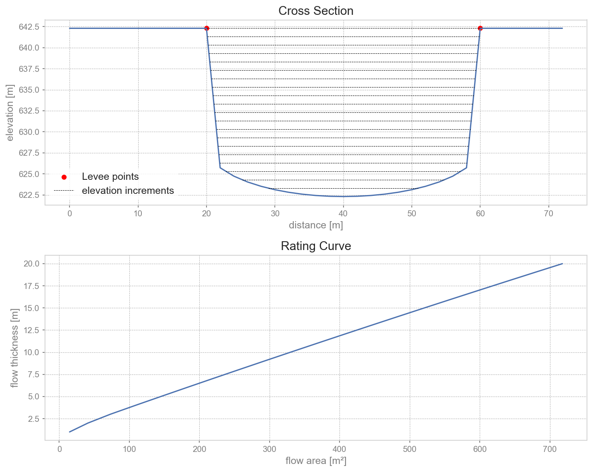

in2TopoHyd: Initial Hydraulic Conditions Module
================================================

:py:mod:`in2TopoHyd` is a module for deriving initial hydraulic conditions for the :py:mod:`c1TIF` computation module
for a debris-flow hydrograph at a prescribed release line. The module combines the topography of the release area with
a time-dependent discharge hydrograph (Topo-Hydrograph) to calculate the corresponding flow thickness and flow velocity at the release line.

The hydraulic conditions are derived from the terrain cross section along the release line.
A rating curve is calculated from the cross-sectional geometry, relating flow thickness to flow area.
For each discharge value of the input hydrograph, the module determines the corresponding mean flow velocity and flow thickness.
The flow thickness is then distributed over the wetted cells of the release cross section.

The resulting initial conditions contain the flow thickness as well as the velocity components in x, y and z direction for every wet cell and every hydrograph timestep.

.. Note::
  The module is still under development and the functions are not fully tested yet!

Theory
-------

The hydraulic boundary conditions are derived in several steps.

1. Terrain cross section
^^^^^^^^^^^^^^^^^^^^^

The release line constists of a starting and an ending point and is first mapped to the DEM raster grid.
The two release-line points are assigned to the nearest raster-cell coordinates. All DEM cells along the resulting line are then extracted.
For each cross-section cell, the module stores its x and y coordinates and its terrain elevation. The distance along the cross section is calculated and used for the subsequent hydraulic calculations.

2. Levee points
^^^^^^^^^^^^^^^^

Two so called levee points define the left and right top of the channel embankment which constrain the flow to the main channel.
Only this part of the cross section  is considered for the calculation of the flow area.

3. Rating curve
^^^^^^^^^^^^

A rating curve is calculated from the terrain cross section between the levee points.
The lowest elevation within this channel section is taken as the minimum channel elevation. Starting from this elevation, the module increases the flow surface elevation in increments of ``dElev``.
For each surface elevation, all cross-section cells below the flow surface are considered wetted. The corresponding flow area is calculated by integrating the flow thickness along the cross section.
It is subsequently used to convert the flow area required for a given discharge into a corresponding flow thickness.

    Channel cross section and corresponding rating curve

4. Flow velocity
^^^^^^^^^^^^

.. Note::
  The current implementation provides the approach after :cite:`Rickenmann1999` as the only available method for calculating the mean flow velocity.

For each discharge value, the mean flow velocity is calculated.
The currently implemented approach :cite:`Rickenmann1999` calculates the veloctiy [m/s] as:

.. math::
  v = 2.1 \cdot Q^{0.33} \cdot S^{0.33}
  :label: velRickenmann

where :math:`Q` is the discharge [m³/s] and :math:`S` is the mean channel slope [m/m] in flow direction.
The slope can either be supplied through the configuration file via :math:`slope` or calculated automatically.
For the automatic calculation, two additional cross sections are generated in a predefined normal distance on each side of the release line.
The mean elevations between the levee points of this virtual cross sections are used to estimate the slope using a central difference:

.. math::
  S = \frac{Elev_j - Elev_i}{2d}
  :label: slope

where `d` is the normal distance between the release line and the virtual cross section.

5. Flow area and flow thickness
^^^^^^^^^^^^^^^^^^^^^^^^^^^^

Once the mean velocity is known, the required flow area :math:`A` [m²] is obtained from the mass balance equation:

.. math::
  A = \frac{Q}{v}
  :label: massBalance

The required flow area is then compared with the previously calculated rating curve and
the flow thickness corresponding to the required flow area is obtained by interpolation of the rating curve.
If the required flow area exceeds the maximum flow area represented by the rating curve,
the module stops and reports that the discharge is overtopping the debris-flow channel.

6. Distribution over the release cross section
^^^^^^^^^^^^^^^^^^^^^^^^^^^^^^^^^^^^^^^^^^^

The calculated flow thickness represents the thickness measured from the lowest point of the channel.
For each timestep, the corresponding surface elevation :math:`Elev_{surf}` [m] is calculated as:

.. math::
  Elev_{surf} = Elev_{min} + \text{flow thickness}.

All cross-section cells with an elevation below this surface are considered wet. For each wet cell, the local flow thickness is calculated as
the difference between the flow surface elevation and the terrain elevation.
Consequently, the resulting initial condition is spatially distributed across the cross section
rather than assigning one constant thickness to every cell.

7. Flow direction
^^^^^^^^^^^^^^

The flow direction is by defintion perpendicular to the release line.

.. Note::
  It is in the responsibility of the user to create a release line normal to the channel flow direction!
  Otherwise correct results cannot be guaranteed.

In a predefined normal distance the program generates two additional cross sections on each side of the release line (compare to calculation of slope).
The mean elevations of this virtual cross sections are then compared to determine which of the two possible normal directions corresponds to the downslope direction.

Input
---------

The :py:mod:`in2TopoHyd` module requires a

* **digital elevation model as raster file**,

* **a time-dependent discharge hydrograph**,

* **a release line**,

* **and levee points**.

:py:mod:`in2TopoHyd` calculations are performed within a process directory, organized with the
folder structure described below.

.. Note::

  ::

    NameOfDebrisFlow/
      Inputs/
        DEM raster file
        HYDR/     - hydrograph csv-file
        LEVEE/    - levee points
        XSECT/    - release line
      Outputs/
        in2TopoHyd/
          initCondHyd.csv
          crossSectionCells.csv                (optional)
        Plots/
          crossSection.png
          ratingCurve.png
      Work/

Digital elevation model
^^^^^^^^^^^^^^^^^^^^^^^

The module uses the provided DEM in ``Inputs`` to obtain the terrain elevation along the release line.
The DEM cell size and raster origin are also used to map the release line to raster cells.

Release line
^^^^^^^^^^^^

The release line is read from the ``Inputs/REL`` directory. It must contain **exactly two points**, representing the starting and ending point of the release line.
If a ``releaseScenario`` is specified in ``(local_)c1TIFCfg.ini``, this file is used (**with** extension .shp). Otherwise, the module searches the ``REL`` directory for a release file.
If no unique release file can be identified, the module stops with an error.
The release line defines the terrain cross section used for the hydraulic calculations.

Levee points
^^^^^^^^^^^^

The module requires exactly one point shapefile in ``Inputs/LEVEE`` whose filename ends with ``*levee.shp``.
The levee points define the lateral limits of the debris-flow channel. Each levee point is assigned to the nearest DEM cell of the release cross section.

Discharge hydrograph
^^^^^^^^^^^^^^^^^^^^

The time-dependent discharge is read from the hydrograph file (.csv) in ``Inputs/REL``.

The hydrograph must contain the columns:

* `timestep` — timestep of the discharge value [s]
* `discharge` — discharge value [m³/s]

The discharge values are used to derive the hydraulic conditions for every timestep of the hydrograph.

Model configuration
--------------------

The model configuration is read from ``in2TopoHydCfg.ini``. A local copy can be created and modified for individual process directories.

The available parameters are:

* ``dElev``
  
  Elevation increment used to calculate the cross-sectional flow area. For low discharge values it might be necessary
  to decrease ``dElev``

* ``velType``
  
  Method used to calculate the mean flow velocity.

* ``slope``
  
  Mean slope in flow direction [m/m]. If this parameter is left empty, the slope is calculated automatically from the DEM.

* ``normalDist``

  Normal distance to release line where two parallel auxiliary cross sections are generated on each side of the release line.
  Used to calculate the channel slope and the flow direction. If this parameter is left empty, the ``normalDist`` is calculated automatically. 

* ``exportCrossSectionCells``
  
  If set to ``True``, the coordinates and elevations of the cross-section cell centers are exported as a CSV file for plausibility checking.

The default parameter values are stored in ``in2TopoHydCfg.ini``.

Output
-------

Initial hydraulic conditions
^^^^^^^^^^^^^^^^^^^^^^^^^^^^

The main output is ``initCondHyd.csv``.

For every wet cross-section cell and hydrograph timestep, the file contains:

* `timestep` — hydrograph timestep [s]
* `thickness` — local flow thickness [m]
* `velocityX` — x-component of flow velocity [m/s]
* `velocityY` — y-component of flow velocity [m/s]
* `velocityZ` — z-component of flow velocity [m/s]
* `x` — coordinate of the wet cell
* `y` — coordinate of the wet cell

The file therefore provides spatially distributed hydraulic initial conditions along the release line.

Cross-section cells
^^^^^^^^^^^^^^^^^^^

If ``exportCrossSectionCells = True``, the module additionally writes ``crossSectionCells.csv``.

The file contains:

* `x` — coordinate
* `y` — coordinate
* `elev` — DEM elevation [m]

This output can be used to check whether the release line has been correctly mapped to the DEM and whether the resulting terrain cross section is plausible.

Plots
^^^^^

Two plots are generated for plausibility checks.

* ``crossSection.png``

  Shows the terrain elevation along the release cross section and the location of the levee points.

* ``ratingCurve.png``

  Contains both the terrain cross section with the calculated flow-surface elevation steps and the resulting relationship between flow thickness and flow area.

These plots are intended to help verify the geometric and hydraulic calculations.

To run
-------

* first go to ``DebrisFrame/debrisframe``

* copy ``debrisframeCfg.ini`` to ``local_debrisframeCfg.ini`` and set your desired process directory name

* create a process directory with the required DEM, release line, levee points and hydrograph

* copy ``in2TopoHyd/in2TopoHydCfg.ini`` to ``in2TopoHyd/local_in2TopoHydCfg.ini`` and, if desired, change the configuration settings

* run:
  ::

    pixi run python runIn2TopoHyd.py

The complete workflow reads the DEM and release information, generates the release cross section, calculates the rating curve,
derives the hydraulic conditions from the discharge hydrograph and writes the resulting initial conditions to ``Outputs/in2TopoHyd/initCondHyd.csv``.
